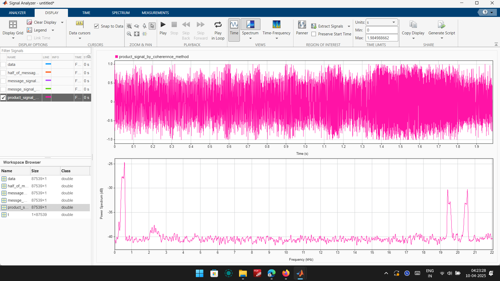
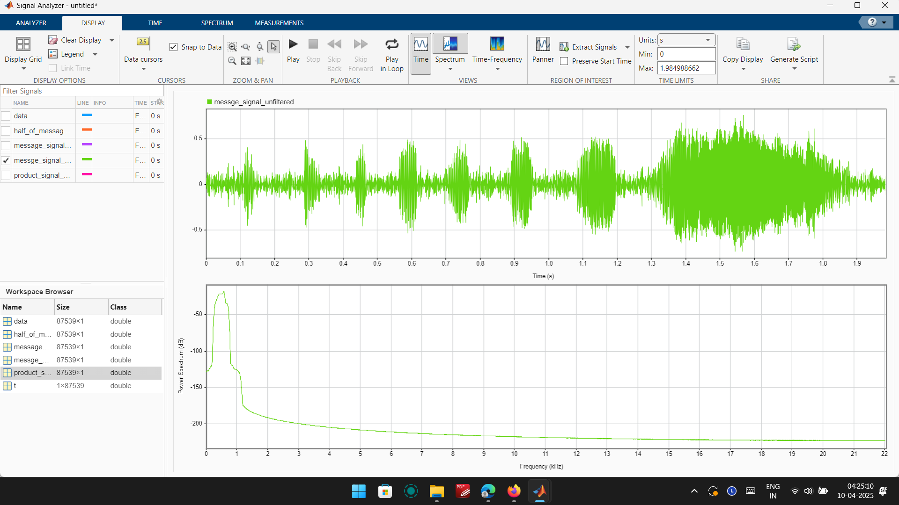

# ERC_Assignment_Submission
This repo contains the solution to the problem of Demodulating and filtering out noise from a Modulated signal

## Process of Demodulating the Signal

- Installation and setup of Matlab

- Learning basics of Matlab and its Signal Processing Toolkit using onramp

- Importing .wav file as data column vector along with a variable fs that stores sampling frequency

- Using the signal Analyzer app, importing signal and specifying time values via sampling rate and initial time

- Performing fast-Fourier transform using the spectrum option in the app

- So, observing the spikes whose average is 10kHz, we know that frequency of carrier wave is 10kHz

- Then, using the coherent detection method, I multiplied the modulated signal with a sinusoidal wave that is in coherence with the carrier wave(first used cosine which gave no low frequency component thus sine had to work due to 90-degree phase difference

- The resulting signal is message signal/2 + some high-frequency signals with freq peaks averaged at carrier frequency*2

- Thus, applying a bandpass filter, I separated the message/2

- Then, multiplying message signal/2, we get message_signal_unfiltered

- Applying the bandpass filter again by experimenting with lower passband frequency and upper passband frequency, I made message_signal_filtered for better quality

- Finally, the sound decoded is Ha Ha Ha Ha Ha Haaaa

